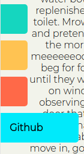

# Finlay George's portfolio website
## Live Site <https://www.fingeorge.dev/>
## ED Workspace <https://edstem.org/courses/4464/workspaces/po7dTJa0A3mgv3ogw5dbbPxHewd39dcP>

The general purpose of my portfolio site is to be simple, aesthetically pleasing and make it easy to find what information you are after.
The target audience for the site is prospective employers, clients and peers looking to know more about myself as a person or a developer.
To this extent the website has been created with an ease of navigation in mind, letting users find exactly the information they are after in a short amount of time in an intuitive way.

Below is the sitemap, the site consists of only four pages. The landing page and 3 other pages.

The first of the features that promotes the ease of navigation on the site are the navbars themselves.
 

The navbars located in the upper left and lower left are present on every page of the website.
The upper navbars are linked to each of the four pages that make up the site. The lower four are all exterior links to my social media pages.
These navbars utilise a hover pseudoclass on desktop and a javascript function to slide out on mobile. Leaving them slightly hidden when reading information on the page.

Adding to the easy to access information mentality, the landing page also features a button that can hand out my resume immediately to anyone that is on my site to possibly access it.

Multiple media breakpoints are also used on each page of the website to adapt the size and styling of various components depending on screensize, as below.

The tech stack for this project is composed almost solely of HTML and CSS, with one Javascript script controlling the sliding of the navbars on mobile.